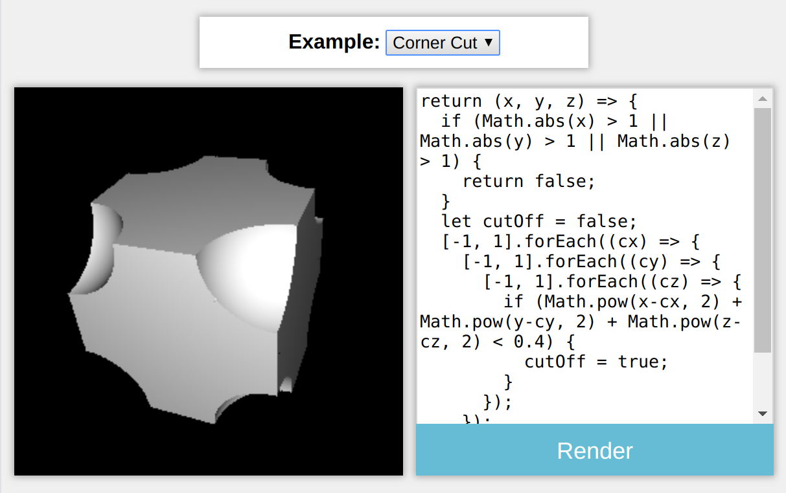
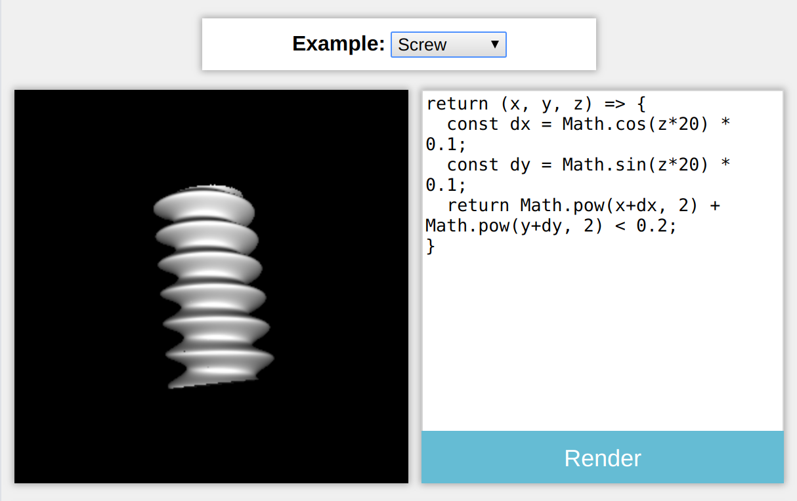
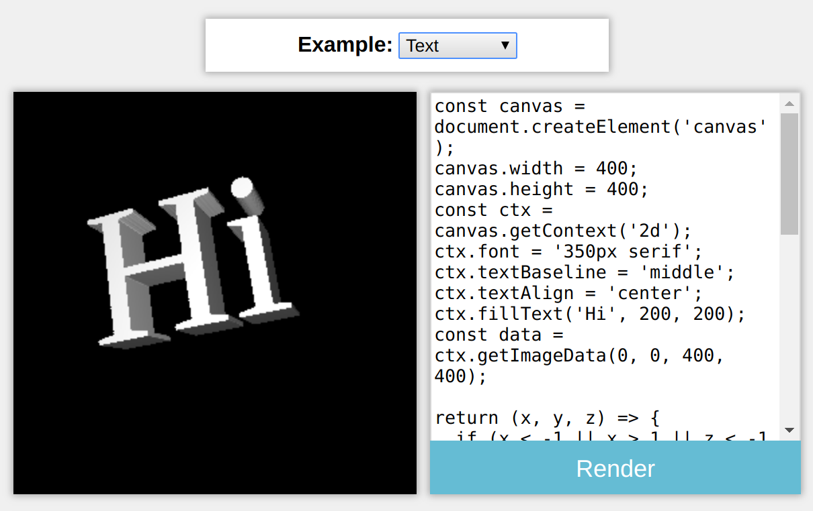

# solid-trace

This demo shows that it is possible to render a 3D object defined as nothing but a boolean function (i.e. "is this (x,y,z) coordinate in the solid?"). While most algorithms for rendering operate on either triangle meshes or compositions of mathematically-defined shapes, this algorithm can work well on any function.

It is well-known how to efficiently render objects defined by [signed distance functions](https://en.wikipedia.org/wiki/Signed_distance_function) (SDFs), which tell you a little more information for each x,y,z (e.g. "how far is this (x,y,z) coordinate from the surface"). However, it can be difficult to implement SDFs by hand for complex shapes. The boolean functions used by this demo are simpler to implement in many cases, but require a more complex rendering algorithm.

# Results

Here are some rendered examples from the application:

# How it works

At a very high level, this demo uses [Ray casting](https://en.wikipedia.org/wiki/Ray_casting) to render each pixel of the object. In other words, for each pixel, it shoots out a ray from the camera towards the object, sees where the ray first hits the object, and uses the normal to the surface at that point to compute the brightness. It starts by rendering a low-resolution image (which can be done quickly), and then asynchronously fills in a higher-resolution version of the rendering.

Ray collisions are found using a simple line search followed by a binary search. First, points along the ray are sampled every epsilon (default 0.01) distance. Once the solid returns true for some point along the ray, a binary search is conducted along the epsilon-length segment of the ray to find exactly where the ray first hits the solid.

Once a point on the surface of the solid has been accurately found, a more complicated search is performed to calculate the normal to the surface. This algorithm uses two runs of a simple bisection search method to find two vectors which are tangent to the surface. It then takes the cross product of these two vectors to get a vector pointing in the direction of the normal.
